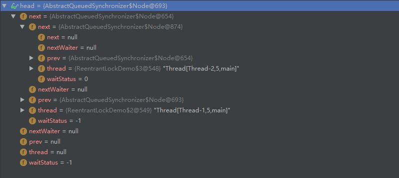
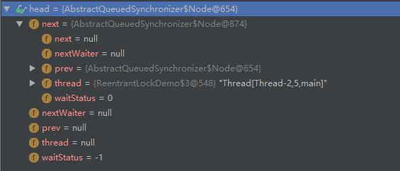

## AQS

### ReentrantLock
#### 同步队列  
1. 入队
   

2. 出队
   

3. 流程描述
    1. AQS里面的state=0，表示没有被锁。state=1表示被锁。
    2. 获取锁后，state+1， 占用锁的线程被保存在AOS的exclusiveOwnerThread中。   
    3. 如果state=1，有新的线程需要获取锁，就会被放入同步队列，相应的就会增加一个Node，Node中包含thread信息，并且把前置结点的waitStatus设置为SIGNAL（-1），然后进入park的等待状态。  
    4. 当占用的线程释放锁以后，即state-1， state回到0，exclusiveOwnerThread设置为null，如果头结点的waitStatus是-1， 唤醒unpark后续那个结点。
    5. 后续那个结点的thread被唤醒后，state+1， 占用锁的线程被保存在AOS的exclusiveOwnerThread中。  把head指向第二个结点，清空thread和prev，并且把前置结点next设置为null（垃圾回收），即当前结点为新的头结点。

