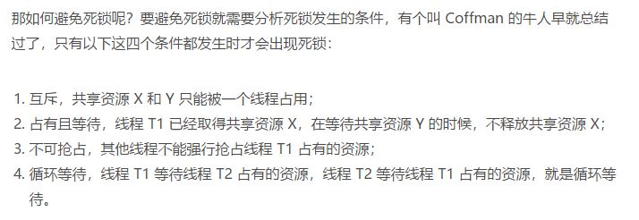

## Java并发编程实战

##  并发问题

#### 核心概念
- 分工
<br/>如何高效地拆解任务并分配给线程

- 同步
<br/>线程之间如何协作

- 互斥
<br/>保证同一时刻只允许一个线程访问共享资源

- 管程(操作系统)
<br/>在Java中称为监视器Monitor, 是一种通用的同步原语。管程，指的是管理共享变量以及对共享变量的操作过程，让他们支持并发。

- 可见性（多CPU）
<br/>多个线程在不同的CPU上执行时，操作的是不同CPU的缓存

- 原子性（线程切换）
<br/>一个或多个操作在CPU执行的过程中不被中断的特性称为原子性。CPU能保证的原子操作是指令界别的，而不是高级语言的操作符

- 有序性（编译优化）

- 逃逸分析
<br/>逃逸分析的基本行为就是分析对象动态作用域，当一个对象在方法中被定义后，可能会被外部方法所引用，比如方法调用，也有可能被其他线程访问，比如类变量，这两种情况分别叫做对象的方法逃逸和线程逃逸

- Java内存模型
<br/>解决了可见性和有序性导致的问题。Java内存模型规范了JVM如何按需禁用缓存以及按需禁用编译优化的方法。
<br/>具体来说，包含volatile, synchronized和final三个关键字，以及六项Happens-Before规则。
    - volatile
    <br/>禁用CPU缓存
    
    - Happens-Before
    <br/>前面一个操作的结果对后续操作是可见的。Happens-Before约束了编译器的优化行为，虽允许编译器优化，但是要求编译器优化后一定遵守Happens-Before规则。
        1. 程序的顺序性规则
        <br/>**在一个线程中**，程序前面对某个变量的修改一定是对后续操作可见的。
        2. volatile变量规则
        <br/>对一个volatile变量的写操作，Happens-Before于后续对这个volatile变量的读操作。
        3. 传递性
        <br/>如果A Happens-Before B, 且B Happens-Before C, 那么A Happens-Before C
        
        4. 管程中锁的规则
        <br/>对一个锁的解锁Happens-Before于后续对这个锁的加锁
        
        5. 线程start()规则
        <br/>主线程A启动子线程B后，子线程B能够看到主线程在启动子线程B前的操作。
        ```text
        Thread B = new Thread(()->{
          // 主线程调用 B.start() 之前
          // 所有对共享变量的修改，此处皆可见
          // 此例中，var==77
        });
        // 此处对共享变量 var 修改
        var = 77;
        // 主线程启动子线程
        B.start();
        ```
        6. 线程join()规则
        <br/>主线程A等待子线程B完成（主线程A通过子线程B的join()方法实现），当子线程B完成后（主线程A中join()方法返回），主线程能够看到子线程的操作。
        <br/>简单理解：如果线程A中，调用线程B的join()并成功返回，那么线程B中的任意操作Happens-Before于该join()操作的返回。
        ```text
        Thread B = new Thread(()->{
          // 此处对共享变量 var 修改
          var = 66;
        });
        // 例如此处对共享变量修改，
        // 则这个修改结果对线程 B 可见
        // 主线程启动子线程
        B.start();
        B.join()
        // 子线程所有对共享变量的修改
        // 在主线程调用 B.join() 之后皆可见
        // 此例中，var==66
        ```
        
    - final
    <br/>final修饰变量时，初衷是告诉编译器，这个变量生而不变，可以使劲优化
        
- synchronized 
    <br/>锁模型  
    
    <br/>当修饰静态方法的时候，锁定的是当前类的 Class 对象
    ```test
    class X {
      // 修饰静态方法
      synchronized(X.class) static void bar() {
        // 临界区
      }
    }
    ```
    <br/>当修饰非静态方法的时候，锁定的是当前实例对象this
    ```test
    class X {
      // 修饰非静态方法
      synchronized(this) void foo() {
        // 临界区
      }
    }
    ``` 
    <br/>加锁本质就是在锁对象的对象头中写入当前线程id，但是new object每次在内存中都是新对象，所以加锁无效。       

- 线程阻塞
<br/>CPU放弃当前线程的执行，进行了线程切换，从而造成阻塞
    - IO 阻塞
    - sleep 阻塞
    - wait 阻塞
    - 同步锁阻塞

- 死锁产生的原因  


- 打破规则，预防死锁  


    1. 一次性申请所有资源
    ```test
    class Allocator {
      private List<Object> als =
        new ArrayList<>();
      // 一次性申请所有资源
      synchronized boolean apply(
        Object from, Object to){
        if(als.contains(from) ||
             als.contains(to)){
          return false;  
        } else {
          als.add(from);
          als.add(to);  
        }
        return true;
      }
      // 归还资源
      synchronized void free(
        Object from, Object to){
        als.remove(from);
        als.remove(to);
      }
    }
    
    class Account {
      // actr 应该为单例
      private Allocator actr;
      private int balance;
      // 转账
      void transfer(Account target, int amt){
        // 一次性申请转出账户和转入账户，直到成功
        while(!actr.apply(this, target));
        try{
          // 锁定转出账户
          synchronized(this){              
            // 锁定转入账户
            synchronized(target){           
              if (this.balance > amt){
                this.balance -= amt;
                target.balance += amt;
              }
            }
          }
        } finally {
          actr.free(this, target);
        }
      } 
    }
    ```
    2. 抢占不到就释放
    <br/> 使用Lock实现，synchronized做不到
    
    3. 按相同顺序申请资源
    ```test
    class Account {
      private int id;
      private int balance;
      // 转账
      void transfer(Account target, int amt){
        Account left = this        ①
        Account right = target;    ②
        if (this.id > target.id) { ③
          left = target;           ④
          right = this;            ⑤
        }                          ⑥
        // 锁定序号小的账户
        synchronized(left){
          // 锁定序号大的账户
          synchronized(right){ 
            if (this.balance > amt){
              this.balance -= amt;
              target.balance += amt;
            }
          }
        }
      } 
    }
    ```
- 管程模型
<br/>Java使用MESA管程模型，当A线程notifyB线程时，B线程会被从条件队列移除，放入等待队列，而A线程继续执行。

- wait()使用while的原因
<br/>由于使用MESA管程模型，线程B在线程A结束前被唤醒，当线程A结束时候，可能被唤醒的线程B不一定满足条件，所以需要while判断。其二可能会出现虚假唤醒。
    
- CPU密集型
<br/>最佳线程数量=CPU核数+1

- I/O密集型
<br/>最佳线程数量=核数*(1+I/O耗时/CPU耗时)

#### 心得
- 锁
- 可竞争CPU时间片状态，例如：sleep
- 在等待队列中需要被唤醒，才能进入可竞争CPU时间片状态，例如：wait