## 数据结构与算法之美

#### 复杂度分析
1. 大 O 复杂度表示法T(n) = O(n)
    - T(n) 表示代码执行的时间；n 表示数据规模的大小；f(n) 表示每行代码执行的次数总和。因为这一个公式，所以用 f(n) 来表示。公式中的 O，表示代码的执行时间 T(n) 与 f(n) 表达式成正比。
    ```text
     int cal(int n) {
       int sum = 0;
       int i = 1;
       for (; i <= n; ++i) {
         sum = sum + i;
       }
       return sum;
     }
    ```
    时间复杂度： T(n) = O(n)
    
    ```text
     int cal(int n) {
       int sum = 0;
       int i = 1;
       int j = 1;
       for (; i <= n; ++i) {
         j = 1;
         for (; j <= n; ++j) {
           sum = sum +  i * j;
         }
       }
     }
    ```
    时间复杂度： T(n) = O(n²)
    
    ```text
     i=1;
     while (i <= n)  {
       i = i * 2;
     }
    ```
    时间复杂度： T(n) = O(logn)

2. 时间复杂度分析（渐进时间复杂度）

    - 只关注循环执行次数最多的一段代码
    ```text
            int cal(int n) {
              int sum = 0;
              int i = 1;
              for (; i <= n; ++i) {
                sum = sum + i;
              }
              return sum;
            }
    ```
    时间复杂度： T(n) = O(n)
    
    - 加法法则：总复杂度等于量级最大的那段代码的复杂度
    ```text
    int cal(int n) {
       int sum_1 = 0;
       int p = 1;
       for (; p < 100; ++p) {
         sum_1 = sum_1 + p;
       }
    
       int sum_2 = 0;
       int q = 1;
       for (; q < n; ++q) {
         sum_2 = sum_2 + q;
       }
     
       int sum_3 = 0;
       int i = 1;
       int j = 1;
       for (; i <= n; ++i) {
         j = 1; 
         for (; j <= n; ++j) {
           sum_3 = sum_3 +  i * j;
         }
       }
     
       return sum_1 + sum_2 + sum_3;
     }
    ```
    时间复杂度： T(n) = O(n²)
    
    - 乘法法则：嵌套代码的复杂度等于嵌套内外代码复杂度的乘积
    ```text
    int cal(int n) {
       int ret = 0; 
       int i = 1;
       for (; i < n; ++i) {
         ret = ret + f(i);
       } 
     } 
     
     int f(int n) {
      int sum = 0;
      int i = 1;
      for (; i < n; ++i) {
        sum = sum + i;
      } 
      return sum;
     }
    ```
    时间复杂度： T(n) = O(n²)
    
3. 常见时间复杂度
    - 多项式量级
    - 非多项式量级：O(2^n) 和 O(n!), 当数据规模n越来越大时，非多项式量级算法的执行时间会急剧增加，所以非多项式时间复杂度的算法是非常低效的算法。
    
4. 空间复杂度分析（渐进空间复杂度）
    ```text
    void print(int n) {
      int i = 0;
      int[] a = new int[n];
      for (i; i <n; ++i) {
        a[i] = i * i;
      }
    
      for (i = n-1; i >= 0; --i) {
        print out a[i]
      }
    }
    ```
    空间复杂度： S(n) = O(n)
    
5. 总结:

    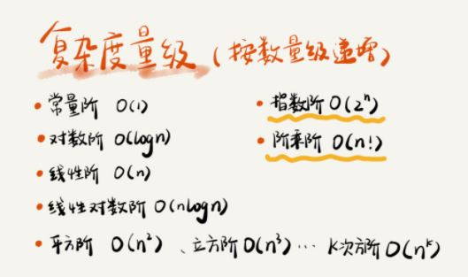  
    
    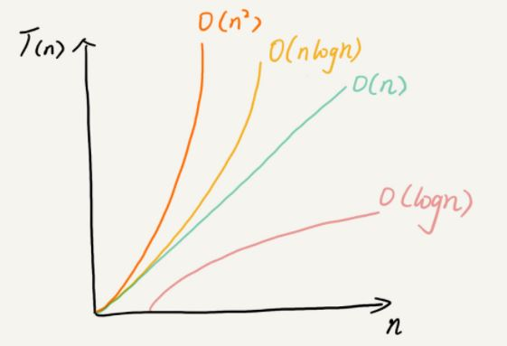  

6. 四个复杂度分析方法
    ```text
    // n 表示数组 array 的长度
    int find(int[] array, int n, int x) {
      int i = 0;
      int pos = -1;
      for (; i < n; ++i) {
        if (array[i] == x) {
           pos = i;
           break;
        }
      }
      return pos;
    }
    ```
    - 最好情况时间复杂度<br/>
      在最理想的情况下，执行这段代码的时间复杂度O(1)
    - 最坏情况时间复杂度<br/>
       在最糟糕的情况下，执行这段代码的时间复杂度O(n)
    - 平均情况时间复杂度（加权平均时间复杂度） 
     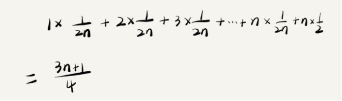 
    - 均摊时间复杂度<br/>
    对一个数据结构进行一组连续操作中，大部分情况下时间复杂度都很低，只有个别情况下时间复杂度比较高，而且这些操作之间存在前后连贯的时序关系，这时候，我们就可以将这一组操作放在一块儿分析，看是否能将较高的时间复杂度那次操作的耗时，平摊到其他那些时间复杂度比较低的操作上。而且，在能够应用均摊时间复杂度分析的场合，一般均摊时间复杂度就等于最好情况时间复杂度。
    
#### 数组

1. 定义
<br/>数组是一种线性表数据结构，他用一组连续的内存空间，来存储一组具有相同类型的数据。

2. 线性表
    - 数组
    - 链表
    - 队列
    - 栈
    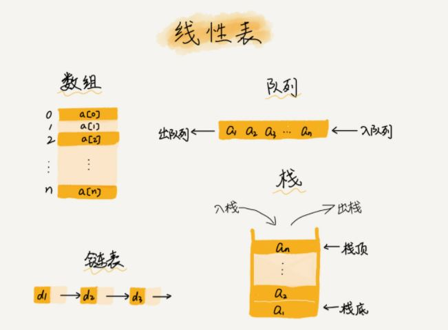

3. 非线性表
    - 二叉树
    - 堆
    - 图
    

4. 寻址
<br/>通过寻址公式直接计算出对应的内存地址：a[i]_address = base_address + i * data_type_size
<br/>a是数组首地址，i是偏移量

5. 盲点
<br/>数组查找的时间复杂度不是O(1)，即使是有序数组通过二分查找也需要O(logn), 是根据下标随机访问时间复杂度为O(1)

6. 下标随机访问时间复杂度
    - O(1)
    
7. 插入时间复杂度
    - 最好时间复杂度：O(1)
    - 最坏时间复杂度：O(n)
    - 平均时间复杂度：O(n)

8. 提高第K个位置插入效率 
    - 把第K个位置的数据放到最后
    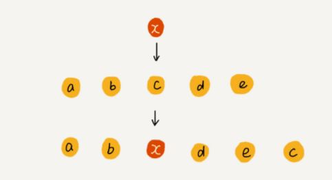

9. 删除时间复杂度
    - 最好时间复杂度：O(1)
    - 最坏时间复杂度：O(n)
    - 平均时间复杂度：O(n)

10. 提高删除效率
    - 把删除的数据先标记，等数组满了后，一次性删除
    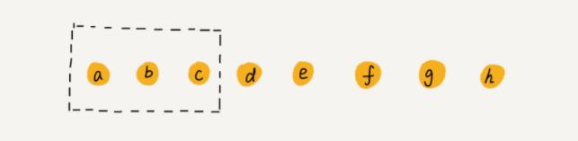
    
11. ArrayList VS Array
    - ArrayList最大的优势就是可以将很多数组操作的细节封装起来，并支持动态扩容，每次存储空间不够的时候，空间自动扩容1.5倍
    - 最好在创建的ArrayList的时候实现指定数据大小，防止动态扩容
    - 数组的优势在于支持基本类型，ArrayList的Autoboxing，Unboxing都有性能消耗

#### 链表

1. 缓存淘汰策略
    - FIFO(First In, First Out)
    - 最少使用策略LFU(Least Frequently Used)
    - 最近最少使用策略LRU(Least Recently Used)
    
2. 数组 VS 链表 内存空间分配
    - 数组需要一块连续的内存空间来存储，对内存的要求比较高，如果我们申请一个100MB大小的数组，如果内存中没有连续的，最够大的存储空间时，即便内存的剩余总可用空间大于100MB，任然会申请失败。
    - 链表不需要一块连续的内存空间， 她通过指针将一组零散的内存块串联起来使用。
    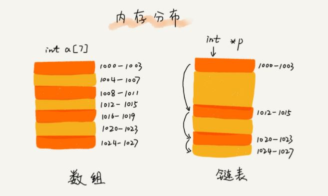

3. 数组 VS 链表 时间复杂度
    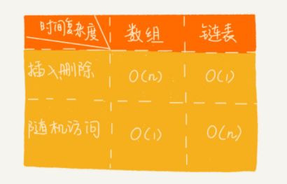
    
4. 链表
    - 单链表
    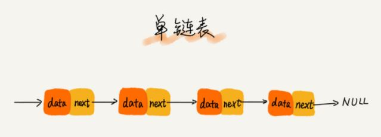
        - 时间复杂度
            - 插入/删除 O(1)
            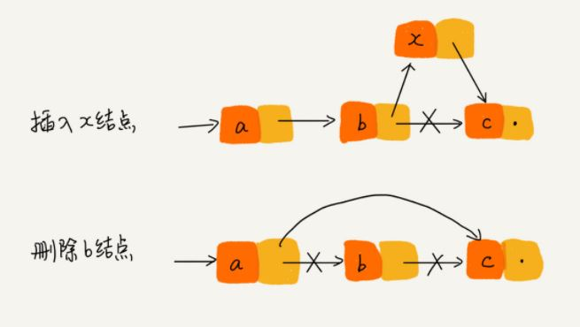
            - 查询(根据指针一个结点一个结点依次遍历) O(n)            
    - 双链表
    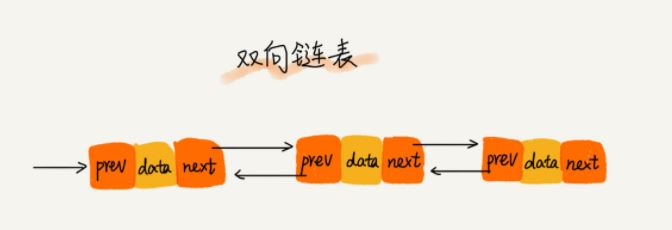
    - 循环链表
    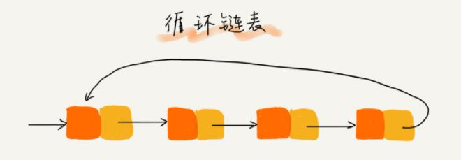
       
4. 时间复杂度

5. 哨兵
    - 针对链表的插入，删除操作，需要对插入第一个结点和删除最后一个结点的情况进行特殊处理，这样代码实现起来就会很繁琐。
    - 哨兵是为了解决边界问题而产生的，引入哨兵后，操作统一为相同的代码实现逻辑。
    - 有哨兵结点的链表叫带头链表，没有哨兵结点的链表叫做不带头链表。

#### 栈

1. 数组和链表确实可以代替栈，满足后进先出，先进后出的特性的场景，我们应该首选“栈”这种数据结构。

2. 栈可以用数组实现（顺序栈），也可以用链表实现（链式栈）。

3. 入栈，出栈平均时间复杂度O(1)，最坏时间复杂度O(n)
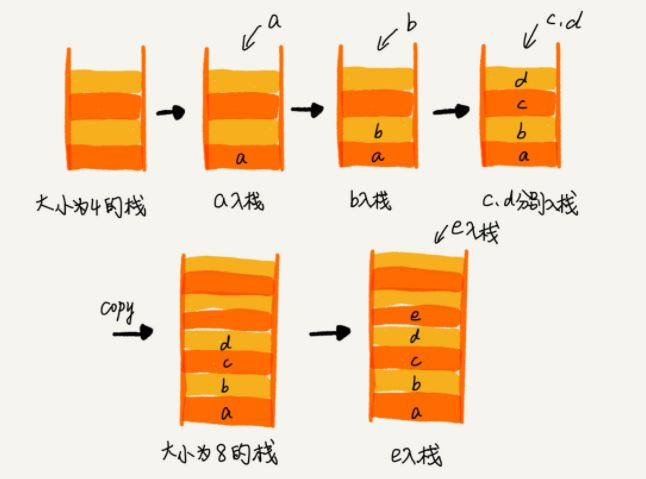

4. 入栈push()

5. 出栈pop()

#### 队列

1. 入队enqueue()

2. 出队dequeue()

3. 顺序队列
    ```text
       // 入队操作，将 item 放入队尾
      public boolean enqueue(String item) {
        // tail == n 表示队列末尾没有空间了
        if (tail == n) {
          // tail ==n && head==0，表示整个队列都占满了
          if (head == 0) return false;
          // 数据搬移
          for (int i = head; i < tail; ++i) {
            items[i-head] = items[i];
          }
          // 搬移完之后重新更新 head 和 tail
          tail -= head;
          head = 0;
        }
        
        items[tail] = item;
        ++tail;
        return true;
      }
    ```
4. 链式队列

5. 循环队列
    ```java
    public class CircularQueue {
      // 数组：items，数组大小：n
      private String[] items;
      private int n = 0;
      // head 表示队头下标，tail 表示队尾下标
      private int head = 0;
      private int tail = 0;
    
      // 申请一个大小为 capacity 的数组
      public CircularQueue(int capacity) {
        items = new String[capacity];
        n = capacity;
      }
    
      // 入队
      public boolean enqueue(String item) {
        // 队列满了
        if ((tail + 1) % n == head) return false;
        items[tail] = item;
        tail = (tail + 1) % n;
        return true;
      }
    
      // 出队
      public String dequeue() {
        // 如果 head == tail 表示队列为空
        if (head == tail) return null;
        String ret = items[head];
        head = (head + 1) % n;
        return ret;
      }
    }
    
    ```

6. 阻塞队列
<br/>当队列空时候，出队阻塞。当队列满时，入队阻塞

7. 并发队列
<br/>队列的操作多线程安全

#### 排序
1. 原地排序
<br/>空间复杂度是O(1)的排序算法

2. 稳定性
<br/>待排序的序列中存在值相等的元素，经过排序后，相等元素之间原有的先后顺序不变

3. 冒泡排序
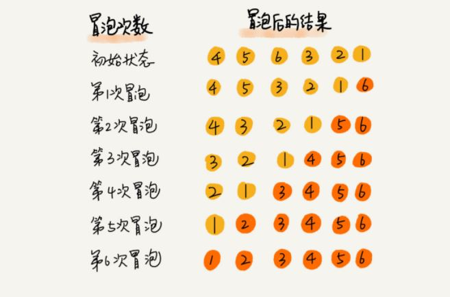

4. 有序度，逆序度，满有序度
<br/>有序度是数组中具有有序关系的元素对的个数
<br/>满有序度n*(n-1)/2
<br/>逆序度=满有序度-有序度

4. 插入排序
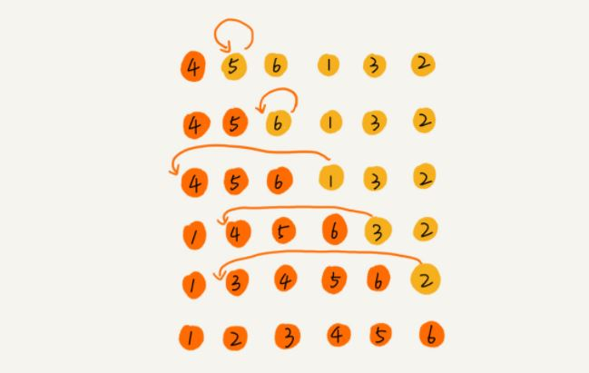

5. 选择排序
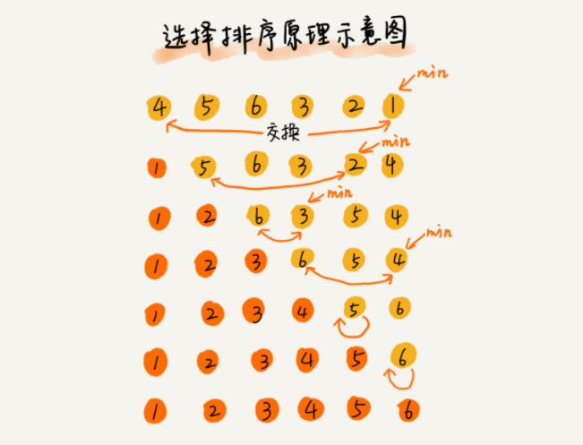

6. 冒泡，插入，选择
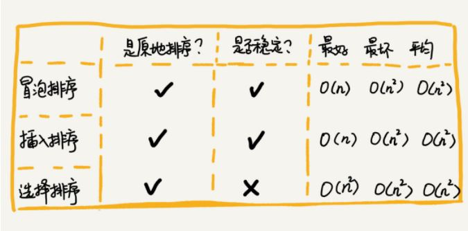


