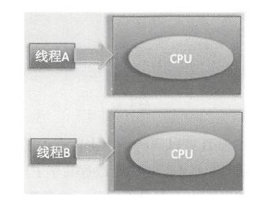
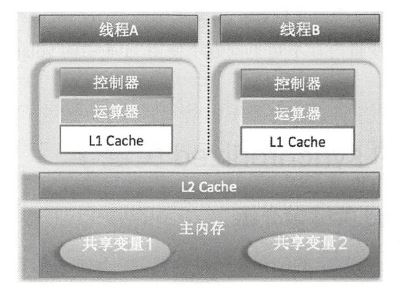
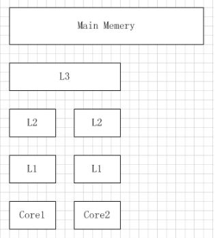
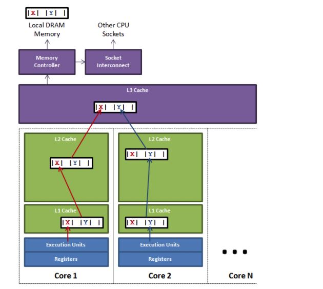

## 并发编程之美

### 线程和进程
进程是系统进行资源分配和调度的基本单位， 线程则是进程的一个执行路径， 一个进程中至少有一个线程，进程中的多个线程共享进程的资源。操作系统在分配资源时是把资源分配给进程的， 但是CPU 资源比较特殊， 它是被分配到线程的， 因为真正要占用CPU 运行的是线程， 所以也说线程是CPU 分配的基本单位。在Java 中，当我们启动main 函数时其实就启动了一个JVM的进程， 而main 函数所在的线程就是这个进程中的一个线程，也称主线程。

### 程序计数器
程序计数器是一块内存区域，用来记录线程当前要执行的指令地址。程序计数器就是为了记录该线程让出CPU 时的执行地址的，待再次分配到时间片时线程就可以从自己私有的计数器指定地址继续执行。另外需要注意的是，如果执行的是native 方法，那么pc 计数器记录的是undefined 地址，只有执行的是Java 代码时pc 计数器记录的才是下一条指令的地址。

### 栈
每个线程都有自己的占资源，用于存储该线程的局部变量，这些局部变量是该线程私有的，其他线程是访问不了的，除此之外枝还用来存放线程的调用技帧。

### 堆
堆是一个进程中最大的一块内存，堆是被进程中的所有线程共享的，是进程创建时分配的，堆里面主要存放使用new 操作创建的对象实例。

### 方法区
方法区则用来存放NM 加载的类、常量及静态变量等信息，也是线程共享的。

### 创建线程的3种方式
- Thread
- Runnable
- FutureTask implements RunnableFuture, 通过get方法可以拿到返回值
    - FutureTask(Callable<V> callable) 
    - FutureTask(Runnable runnable, V result)


### Callable VS Runnable
- Runnable中run没有返回值，不能抛异常
- Callable中call有返回值，能抛异常

### wait()
- 调用线程会被阻塞挂起，直到其他线程调用了该共享对象的notify()或者notifyAll()方法
- 调用线程会被阻塞挂起，直到调用了该线程的interrupt()方法， 该线程抛出InterruptedException异常返回。
- 如果调用wait()方法的线程没有事先获取该对象的监视器锁，则调用wait()方法时调用线程会抛出IllegalMonitorStateException异常。
- 每个线程可以有多个监视器锁(obj1,obj2,obj3), 当前线程调用共享变量obj1的wait()方法后只会释放当前共享变量obj1上的锁，如果当前线程还持有其他共享变量(obj2,obj3)的锁，则这些锁是不会被释放的。
- wait()底层调用wait(0), wait(long timeout)到超时时间，自动返回。

### notify()
- 一个线程调用共享对象的notify()方法后，会唤醒一个在该共享变量上调用wait系列方法后被挂起的线程。一个共享变量上可能会有多个线程在等待，具体唤醒哪个等待的线程是随机的。
- 被唤醒的线程不能马上从wait 方法返回并继续执行，它必须在获取了共享对象的监视器锁后才可以返回也就是唤醒它的线程释放了共享变量上的监视器锁后，被唤醒的线程也不一定会获取到共享对象的监视器锁，这是因为该线程还需要和其他线程一起竞争该锁，只有该线程竞争到了共享变量的监视器锁后才可以继续执行。
- 只有当前线程获取到了共享变量的监视器锁后, 才可以调用共享变量的notify()方法，否则会抛出IllegalMonitorStateException 异常。
- 线程A首先获取resourceA 上面的锁，然后调用resourceA 的wait（）方法挂起当前线程并释放获取到的锁，然后线程B获取到resourceA 上的锁井调用resourceA 的wait（）方法，此时线程B 也被阻塞挂起并释放了resourceA 上的锁，到这里线程A 和钱程B 都被放到了resourceA 的阻塞集合里面。线程C 休眠结束后在共享资源resourceA 上调用了notify（） 方法，这会激活resourceA 的阻塞集合里面的一个线程，这里激活了线程A，所以线程A 调用的wait()方法返回了，线程A 执行完毕。而线程B 还处于阻塞状态。

### notifyAll()
- 不同于在共享变量上调用notify()函数会唤醒被阻塞到该共享变量上的一个线程，notifyAll()方法则会唤醒所有在该共享变量上由于调用wait 系列方法而被挂起的线程。
- 在共享变量上调用notifyAll（）方法只会唤醒调用这个方法前调用了wait 系列函数而被放入共享变量等待集合里面的线程。如果调用notifyA ll（）方法后一个线程调用了该共享变量的wait（）方法而被放入阻塞集合， 则该线程是不会被唤醒的。

### 虚假唤醒
-  该线程没有被其他线程调用notify()、notifyAll()方法进行通知，或者被中断，或者等待超时，但这个线程从挂起状态变为可以运行状态（也就是被唤醒），这就是虚假唤醒。
- 虽然虚假唤醒在应用实践中很少发生，但要防患于未然，做法就是不停地去测试该线程被唤醒的条件是否满足，不满足则继续等待，也就是说在一个循环中调用wait()方法进行防范。
```text
synchronized（obj) {
while（条件不满足)
obj.wait() ;
}
```

### sleep()
- 调用线程会暂时让出指定时间的CPU执行权，也就是在这期间不参与CPU 的调度，但是该线程所拥有的监视器资源，比如锁还是持有不让出的。
- 如果在睡眠之前或者期间，其他线程调用了该线程的interrupt（）方法中断了该线程，则该线程会在调用sleep 方法的地方抛出InterruptedException 异常而返回。

### 解决死锁（打破持有并等待原则）
- 一个线程同时获取A,B资源，才执行。
- 一个线程获取到A资源，如果在获取B资源失败，则放弃A资源。
- 不同线程保持相同的顺序去获取资源，即都是A->B。

### join()
- 使用场景：需要等待多个线程全部加载完毕再汇总处理。
- **在线程A中调用B.join(), 线程A等线程B执行完成, 如果要中断线程A，需要调用A.interrupt(), 而不是B.interrupt()。**

### Thread类的静态方法
- currentThread()
- yield()
- sleep()

### yield()
- Thread 类中有一个静态的yield 方法，当一个线程调用yield 方法时，实际就是在暗示线程调度器当前线程请求让出自己的CPU 使用，但是线程调度器可以无条件忽略这个暗示。我们知道操作系统是为每个线程分配一个时间片来占有CPU 的， 正常情况下当一个线程把分配给自己的时间片使用完后，线程调度器才会进行下一轮的线程调度，而当一个线程调用了Thread 类的静态方法yield 时，是在告诉线程调度器自己占有的时间片中还没有使用完的部分自己不想使用了，这暗示线程调度器现在就可以进行下一轮的线程调度。
- 当一个线程调用yield 方法时， 当前线程会让出CPU 使用权，然后处于就绪状态，线程调度器会从线程就绪队列里面获取一个线程优先级最高的线程，当然也有可能会调度到刚刚让出CPU 的那个线程来获取CPU 执行权。

### 线程中断
- Java 中的线程中断是一种线程间的协作模式，通过设置线程的中断标志并不能直接终止该线程的执行， 而是被中断的线程根据中断状态自行处理。

### interrupt()
- 中断线程，设置中断标志仅仅是设置标志， 线程A 实际并没有被中断， 它会继续往下执行。如果线程A 因为调用了wait 系列函数、join 方法或者sleep 方法而被阻塞挂起，线程A 会在调用这些方法的地方抛出InterruptedException 异常而返回。

### isInterrupted(boolean ClearInterrupted)
- 检测当前线程是否被中断，如果是返回true ， 否则返回false 。
- ClearInterrupted是false，不清除中断标志，如果是true，清除中断标志。

### Thread.interrupted()
- 检测**当前线程**是否被中断， 如果是返回true ， 否则返回false
- 底层调用isInterrupted(true), 清除中断标志。

### 线程上下文切换
- 当前线程使用完时间片后，就会处于就绪状态并让出CPU 让其他线程占用， 这就是上下文切换，从当前线程的上下文切换到了其他线程。在切换线程上下文时需要保存当前线程的执行现场， 当再次执行时根据保存的执行现场信息恢复执行现场。

### 线程分类
- 守护线程daemon 
    - 当最后一个用户线程（非守护线程）结束时， JVM 会正常退
- 用户线程user 
    - 当父线程结束后，子线程还是可以继续存在的，也就是子线程的生命周期并不受父线程的影响。这也说明了在用户线程还存在的情况下JVM进程并不会终止。

- JVM自动退出
    - main 线程运行结束后， JVM会自动启动一个叫作DestroyJavaVM的线程， 该线程会等待所有用户线程结束后终止JVM进程。

### ThreadLocal
- ThreadLocal 是就是一个工具壳，它提供了线程本地变量，也就是如果你创建了一个ThreadLocal 变量，那么访问这个变量的每个线程都会有这个变量的一个本地副本。当多个线程操作这个变量时，实际操作的是自己本地内存里面的变量，从而避免了线程安全问题。
- 它通过set方法把value值放入调用线程的threadLocals里面并存放起来，当调用线程调用它的get方法时，再从当前线程的threadLocals 变量里面将其拿出来使用。通过调用ThreadLocal 变量的remove 方法，从当前线程的threadLocals 里面删除该本地变量。
- 每个线程可以关联多个ThreadLocal 变量，存放于ThreadLocal.ThreadLocalMap threadLocals，结构相当于ThreadLocal.ThreadLocalMap(ThreadLocal, value)

### InheritableThreadLocal<T> extends ThreadLocal<T> 
- 是个工具壳， 在Thread.init方法中会复制父线程的inheritableThreadLocals到子线程。
```text
        if (parent.inheritableThreadLocals != null)
            this.inheritableThreadLocals =
                ThreadLocal.createInheritedMap(parent.inheritableThreadLocals);
```
- InheritableThreadLocal中存放的value，如果父线程set后改变，子类未必可以看到，需要加volatile

### 并发和并行




### 工作内存和主存
Java 内存模型里面的工作内存，就对应这里的Ll 或者L2 缓存或者CPU 的寄存器。


### CPU核
- 寄存器
- 控制器
- 运算器

### 内存可见性
问题出在每个CPU自己的工作内存，比如：L1 cache

### synchronized 的内存语义
- 进入synchronized 块的内存语义是把在synchronized块内使用到的变量从线程的工作内存中清除，这样在synchronized块内使用到该变量时就不会从线程的工作内存中获取，而是直接从主内存中获取。
- 退出synchronized 块的内存语义是把在synchronized 块内对共享变量的修改刷新到主内存。
- 其实这也是加锁和释放锁的语义，当获取锁后会清空锁块内本地内存中将会被用到的共享变量，在使用这些共享变量时从主内存进行加载，在释放锁时将本地内存中修改的共享变量刷新到主内存。
- 原子性
- 内存可见性
- 内置锁， 可重入锁

### volatile
- 内存可见性
- 有序性
- 单一指令的原子性（读64位long型变量）

### javap
- -c 对代码进行反汇编
- -p -private 显示所有类和成员包括私有

### CAS
- Compare and Swap
- 硬件级别保证原子性, 底层调用C++
- 自旋锁

### AtomicStampedReference
- 给每个变量的状态值都配备了一个时间戳，解决了CAS的ABA问题

### Unsafe
不能直接调用Unsafe getUnsafe()，会抛出SecurityException，因为只能由BootstrapClassLoader装载。但可以通过反射拿到static final Unsafe theUnsafe;
- compareAndSwapLong
- void park(boolean isAbsolute, long time） 
    - isAbsolute等于false 且time 等于0 表示一直阻塞。time 大于0 表示等待指定的time 后阻塞线程会被唤醒， 这个time 是个相对值.
    - 如果isAbsolute 等于true ， 并且time 大于0 ，则表示阻塞的线程到指定的时间点后会被唤醒，这里time 是个绝对时间， 是将某个时间点换算为ms 后的值。
    - 当其他线程调用了当前阻塞线程的interrupt方法而中断了当前线程时， 当前线程也会返回，但不会抛出中断异常。 而当其他线程调用了unPark 方法并且把当前线程作为参数时当前线程也会返回。
- void unpark(Object thread）
    - 唤醒调用park 后阻塞的线程。
- long long getAndSetLong(Object object, long offset, long update)

### 缓存行
- CPU对缓存的修改又是以缓存行为最小单位的，今天的CPU不再是按字节访问内存，而是以64字节为单位的块(chunk)拿取，称为一个缓存行(cache line)。当你读一个特定的内存地址，整个缓存行将从主存换入缓存，并且访问同一个缓存行内的其它值的开销是很小的。
- CPU Cache分成了三个级别：L1，L2，L3。越靠近CPU的缓存越快也越小。所以L1缓存很小但很快，并且紧靠着在使用它的CPU内核。L2大一些，也慢一些，并且仍然只能被一个单独的 CPU 核使用。L3在现代多核机器中更普遍，仍然更大，更慢，并且被单个插槽上的所有 CPU 核共享。最后，你拥有一块主存，由全部插槽上的所有 CPU 核共享。
    

### 伪共享（False Sharing）
- 下图中，一个运行在处理器 core1上的线程想要更新变量 X 的值，同时另外一个运行在处理器 core2 上的线程想要更新变量 Y 的值。但是，这两个频繁改动的变量都处于同一条缓存行。两个线程就会轮番发送 RFO 消息，占得此缓存行的拥有权。当 core1 取得了拥有权开始更新 X，则 core2 对应的缓存行需要设为 I 状态。当 core2 取得了拥有权开始更新 Y，则 core1 对应的缓存行需要设为 I 状态(失效态)。轮番夺取拥有权不但带来大量的 RFO 消息，而且如果某个线程需要读此行数据时，L1 和 L2 缓存上都是失效数据，只有 L3 缓存上是同步好的数据。从前一篇我们知道，读 L3 的数据非常影响性能。更坏的情况是跨槽读取，L3 都要 miss，只能从内存上加载。表面上 X 和 Y 都是被独立线程操作的，而且两操作之间也没有任何关系。只不过它们共享了一个缓存行，但所有竞争冲突都是来源于共享。
    

### 避免伪共享
- 手动填充64字节（类对象头8字节）
- @Contended （如果用户类路径下的类需要使用这个注解， 则需要添加JVM参数：－XX:-RestrictContended 。填充的宽度默认为128 ，要自定义宽度则可以设置－XX:ContendedPaddingWidth 参数。）

### 乐观锁与悲观锁
- 悲观锁 排它锁
- 乐观锁 自旋锁

### 公平锁与非公平锁
- 公平锁表示线程获取锁的顺序是按照线程请求锁的时间早晚来决定的，也就是最早请求锁的线程将最早获取到锁。
- 非公平锁则在运行时闯入，也就是先来不一定先得。

### 独占锁与共享锁
- 独占锁保证任何时候都只有一个线程能得到锁， ReentrantLock 就是以独占方式实现的。
- 共享锁则可以同时由多个线程持有，例如ReentrantReadWriteLock 读写锁，它允许一个资源可以被多线程同时进行读操作。

### 自旋锁
- 默认次数是10 ，可以使用－XX :PreBlockSpinsh 参数设置该值

### Random VS ThreadLocalRandom
- nextInt 主要逻辑：
    1. 首先根据老的种子生成新的种子。
    2. 然后根据新的种子来计算新的随机数。
- 对比：
    1. 在多线程下使用单个Random 实例生成随机数时，当多个线程同时计算随机数来计算新的种子时， 多个线程会竞争同一个原子变量的更新操作，由于原子变量的更新是CAS 操作，同时只有一个线程会成功，所以会造成大量线程进行自旋重试， 这会降低并发性能。
    2. ThreadLocalRandom 使用ThreadLocal的原理，让每个线程都持有一个本地的种子变量，该种子变量只有在使用随机数时才会被初始化。在多线程下计算新种子时是根据自己线程内维护的种子变量进行更新，从而避免了竞争。
   
   
### ThreadPoolExecutor

- interruptIdleWorkers  
方法会使用tryLock方法来判断线程池中的线程是否是空闲状态