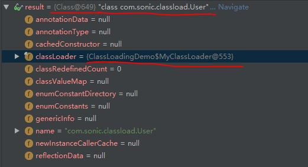
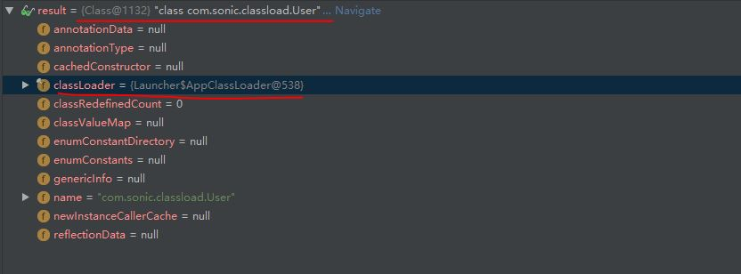
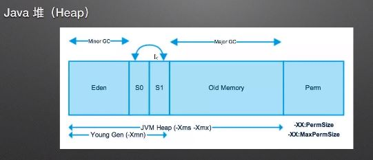

## Java 存储管理

- ClassLoader
    1. 在没有装载过的前提下，不同ClassLoader装载相同User类文件，会产生不同的Class对象，Class对象中的classLoader属性指向的是真正加载它的classLoader。比如：MyClassLoader去加载，其实classLoader属性是AppClassLoader
    
    
    2. 如果对应的ClassLoader已经装载过，则会直接返回Class对象，返回的Class对象是根据去加载的ClassLoader去寻找。比如： MyClassLoader去加载，搜索的就是MyClassLoader

- Class 加载检测-verbose:class
- Java内存结构
    - Java 堆
        - -Xms
        - -Xmx
        - 
        - young(eden+survivor) + old
    - 方法区
    - JVM栈
        - -Xss
        - 原生类型（int）
        - 引用对象
    - 本地方法栈
    - PC寄存器
