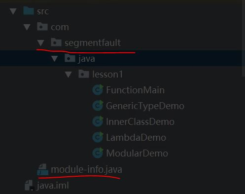

## Java语言基础
1. Java类型 （`long double` 32位操作系统非线程安全，需要加`volatile`，保证64位同时读和写）
    - 原生类型
    - 对象类型
    - 数组类型
    - 集合类型

2. Reference
    - 强引用 `StrongReference`
    - 软引用 `SoftReference`
    - 弱引用 `WeakReference`
    - 虚引用 `PhantomReference`

3. 面向对象3个特性（Java是部分面向对象语言，因为有原生类型）
    - 封装性
    - 派生性
    - 多态性

4. GOF23
    - 构建
    - 结构
    - 行为
    
5. 异常
    1. Throwable 结构
    - Throwable
        - Exception
            - Checked Exception
            - Unchecked Exception `RuntimeException`
        - Error
    2. 异常跟踪: `private Throwable cause`
    3. `fillInStackTrace`性能问题
        - 方法一：JVM 参数控制栈深度（物理屏蔽）
        - 方法二：logback 日志框架控制堆栈输出深度（逻辑屏蔽）

6. 语言
    - 静态语言：是编译执行，编译成字节码，解释成机器码执行（java）
    - 动态语言：运行时解释执行（javascript）

7. `javap`的使用: 
    - 查看汇编代码
    ```
    F:\BigData\SpringBootLearning\projects\thinking-in-java\target\classes\com\sonic\juc\yield>javap -v YieldMain
    ```
    - 内部类$,可能需要使用.替换
    ```
    javap -v ThreadCreation$CallerTask
    javap -v ThreadCreation.CallerTask
    ```
8. 函数式接口
    - Supplier：有输出没有输入
    - Consumer：有输入没有输出
    - Function：有输入有输出
    - Predicate：有输入有输出，输出是`boolean`
    - `Action` (java没有)
    
9. 函数式接口`@FunctionalInterface`
    - 只包含一个抽象方法
    - 可以包含default方法
    - 可以包含Object的方法，相当于覆写了Object方法，语义如下：
    ```
    default int hashcod(){
        return super.hashcode();
    }
    ```
10. 模块化
    - 例子module-info.java
    ```
    mudule lesson1 {
        requires java.base; //默认导入，可以不写 
        // requires java.sql; //依赖SQL（JDBC）
        exports com.segmentfault.java.lesson1; //包下面一定要有类， 并非所有的public class都可以被使用，需要exports配合
        exports transitive java.sql; //传递依赖，可以使用Logger
    }
    ```
    

11. printStackTrace性能问题
    - printStackTrace()方法会导致异常堆栈输出到标准错误，标准错误是操作系统共享的，进程之间会有切换，A,B两个进程同时往标准输出写，A写的时候，B要等待。

